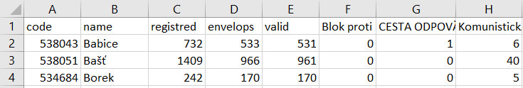

POPIS PROGRAMU :
Program scraper.py pracuje resp. čte výsledky voleb do poslanecké sněnmovny parlamentu České republiky konané v roku 2017.
Pro projekt jsem vybral část Praha - východ.
Odkaz na web stránku je https://volby.cz/pls/ps2017nss/ps32?xjazyk=CZ&xkraj=2&xnumnuts=2109
Program čte informace jako je Code -kod obec, Name-nazev obce, Registred-voliči v seznamu, Envelops-vydané obálky, Valid-platné hlasy a pak jednotlivé politické strany a jejích zisk ve volbách pro konkretní obec.
Nakonec program zapisuje dané informace do CSV souboru s názvem "vysledky_praha_vychod.csv".

SPUŠTĚNÍ PROGRAMU :
Program je možné spusit v Terminal servru pomoci příkazu:

python scraper.py "https://volby.cz/pls/ps2017nss/ps311?xjazyk=CZ&xkraj=2&xnumnuts=2109" "vysledky_praha_vychod.csv"

Pro kontrolu správnosti je přidán výpis :
Jméno spuštěného programu je: scraper.py
Jméno Url je: https://volby.cz/pls/ps2017nss/ps311?xjazyk=CZ&xkraj=2&xnumnuts=2109
Jméno souboru je: vysledky_praha_vychod.csv

V případ zadáni nesprávniho příkazu, program užívatele upozorní

KNIHOVNY POUŽITÉ V PROGRAMU:

V programu byly použite zabudované knihovny ale i knihovny třetích strán, které je potřeba před spuštěním programu nainstalované. Je vhodné vytvořit virtuálne prostředí, aby se predešlo komplikacím s prepsánim predešlích verzí knihoven.

Vytvoření virtuálniho prostředí:
prostředí se vytvoří v príkazovem řádku pomoci príkazu : python -m venv moje_prvni_prostredi
následne se musí aktivovat : moje_prvni_prostredi\Scripts\Activate.ps1 - pro Windows nebo
source moje_prvni_prostredi/bin/activate - pro Linux a MacOS.

Zabudované knihovny jsou : sys,csv
Knihovny třetích strán jsou: requests, bs4. Knihovny instaluješ v přikazovém řádku pomoci příkazu : pip install <jmeno_knihovny>

UKÁZKA VÝSTUPNÍHO CSV SOUBORU:

